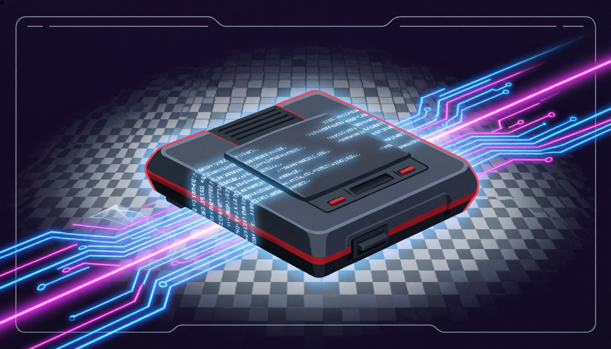
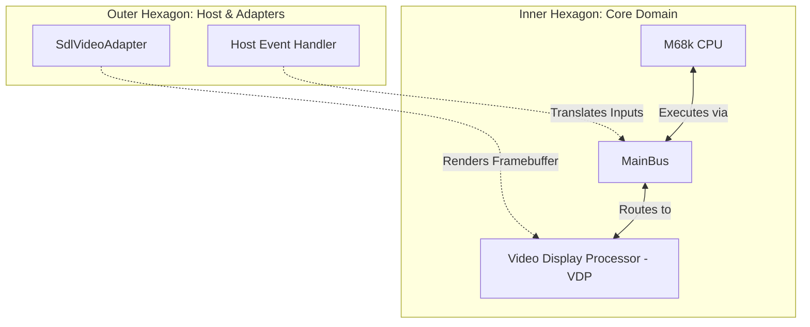
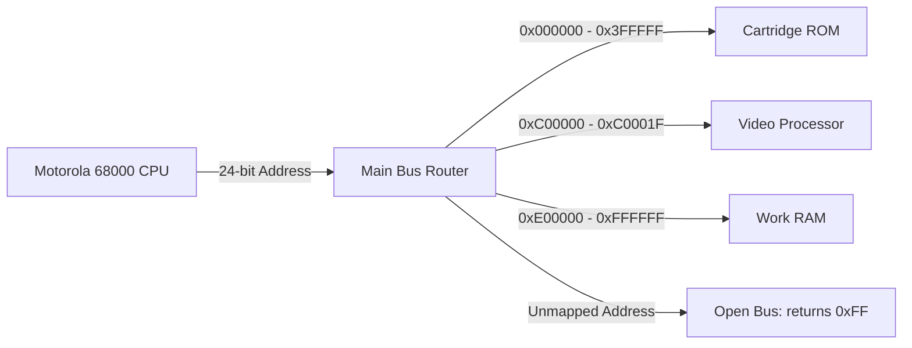

# GenesisEmu 🎮

> A high-performance, strictly decoupled Sega Genesis (Mega Drive) emulator built from the ground up using C++20, Domain-Driven Design (DDD), SOLID principles, Hexagonal Architecture, and Test-Driven Development (TDD).



*Note: You can generate a beautiful header image using DALL-E 3 or Midjourney with this prompt:*
> **Prompt:** "A sleek retro-modern developer banner, flat vector design combined with glowing neon circuitry. It features a Sega Genesis console integrated into abstract digital source code, glowing blue and magenta laser traces, a stylized pixel-art grid, and clean interface lines. Vaporwave 80s arcade aesthetic, extremely professional, 16:9 aspect ratio."

---

## 🏛️ Architecture & System Design

`GenesisEmu` is designed using **Hexagonal Architecture (Ports & Adapters)**. This guarantees that the core emulation logic has **zero dependencies** on third-party graphics/audio libraries or host operating system APIs.

### System Context Diagram (Hexagonal)



### MainBus Memory Routing Diagram

The `MainBus` acts as a mediator (Dependency Inversion), dynamically routing 24-bit physical memory addresses requested by the CPU to the appropriate virtual hardware devices:



---

## 🚀 Quick Start (WSL2 & Docker)

Thanks to our unified `Makefile` and containerized toolchain, you don't need to install compilers or libraries on your host system. Everything is automated.

### Prerequisites
*   Windows 10 with **WSL2** (including WSLg for native hardware accelerated graphics).
*   **Docker** and **Docker Compose** installed and integrated with WSL2.
*   Nvidia GTX 1060 (6GB VRAM) or equivalent (configured for hardware accelerated rendering in WSL).

### Build & Run Commands

Open your WSL terminal in the project root directory and execute:

```bash
# 1. Initialize and build the C++20 compiler Docker container
make setup

# 2. Compile and run the TDD Unit Test suite (GoogleTest)
make test

# 3. Build and execute the emulator natively on WSLg utilizing your GPU
make run

# 4. Clean up compiler cache and build artifacts
make clean
```

---

## 📂 Project Directory Structure

```text
/GenesisEmu
 ├── /assets               # Images, banners, and media
 ├── /docs                 # Software Design Documents (SDD) and specifications
 ├── /tests                # TDD Unit Test Suite
 │    ├── Core/            # Unit tests for M68k CPU, VDP, and MainBus
 ├── /src                  # Source Code
 │    ├── /Core            # The Inner Hexagon (M68k, VDP, MainBus, IBus) - No SDL!
 │    ├── /Adapters        # The Outer Hexagon (SdlVideoAdapter) - Handles GPU rendering
 │    └── /App             # Application entry point (main.cpp)
 ├── Dockerfile            # C++20 compiler environment container
 ├── docker-compose.yml    # Development task orchestrator
 ├── CMakeLists.txt        # Master CMake build configuration
 └── Makefile              # Developer command gateway
```

---

## 🧪 Current TDD Test Status

Currently, the emulator core has **7 passing unit tests** covering:
*   [x] Bus device attachment and range boundary calculations.
*   [x] Dynamic memory routing (ROM and RAM offsets).
*   [x] Safe handling of unmapped memory address accesses (Open Bus simulation).
*   [x] CPU initial register loading (SSP and PC vectors read from ROM during Reset).
*   [x] Execution of basic instructions (`NOP` opcode execution and cycle timing verification).
*   [x] VDP write-pending register commands and status checks.
*   [x] VDP auto-increment and 32-bit control port command decoding.